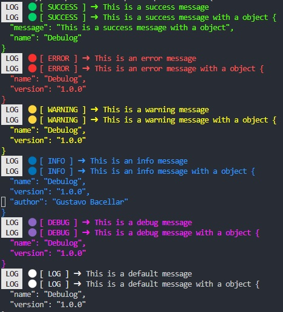

# react-native-debulog

`react-native-debulog` is a versatile and customizable logging library for React Native applications, allowing you to enhance your debugging and logging capabilities with ease.

## Installation

To install `react-native-debulog`, you can use npm or yarn:

```bash
npm install react-native-debulog
```

or

```bash
yarn add react-native-debulog
```

## Usage

Import the library and its functions into your React component file:

```jsx
import * as React from 'react';

import { StyleSheet, View } from 'react-native';
import {
  log,
  logDebug,
  logError,
  logInfo,
  logSuccess,
  logWarning,
  setLogOptions,
} from '../../src/index';

export default function App() {
  React.useEffect(() => {
    setLogOptions({
      hideLogs: false, // you can hide all logs on production if you want __DEV__
      hasArrow: true,
      showBadge: true,
      hasJsonStringify: true,
      stringifySpaces: 2,
    });
    logSuccess('This is a success message');
    logSuccess('This is a success message with a object', {
      message: 'This is a success message with a object',
      name: 'Debulog',
    });

    logError('This is an error message');
    logError('This is an error message with a object', {
      name: 'Debulog',
      version: '1.0.0',
    });
    logWarning('This is a warning message');
    logWarning('This is a warning message with a object', {
      name: 'Debulog',
      version: '1.0.0',
    });
    logInfo('This is an info message');
    logInfo('This is an info message with a object', {
      name: 'Debulog',
      version: '1.0.0',
      author: 'Gustavo Bacellar',
    });
    logDebug('This is a debug message');
    logDebug('This is a debug message with a object', {
      name: 'Debulog',
      version: '1.0.0',
    });
    log('This is a default message');
    log('This is a default message with a object', {
      name: 'Debulog',
      version: '1.0.0',
    });
  }, []);

  return <View style={styles.container} />;
}

const styles = StyleSheet.create({
  container: {
    flex: 1,
    alignItems: 'center',
    justifyContent: 'center',
  },
  box: {
    width: 60,
    height: 60,
    marginVertical: 20,
  },
});
```

## Customization

You can customize the log options by using the `setLogOptions` function:

```jsx
setLogOptions({
  hideLogs: false, // you can hide all logs on production if you want __DEV__
  hasArrow: true,
  showBadge: true,
  hasJsonStringify: true,
  stringifySpaces: 2,
});
```

## Preview



# Contribution Guide

Welcome to the project! We're delighted that you want to contribute. This guide will walk you through how to do so effectively.

## Author and Contributors

This project is maintained by [Gustavo Bacellar](https://github.com/gustavobacellarladeira).

If you would like to contribute to this project, please follow the [Contribution Guidelines](#passos-para-contribuir).

## Contribution Guidelines <a name="steps-to-contribute"></a>

1. **Fork the Repository**

   Click the "Fork" button in the top right corner of this page to create a copy of the repository in your own GitHub account.

2. **Clone the Repository**

   Clone your fork locally to your machine:

   ```bash
   git clone https://github.com/gustavobacellarladeira/react-native-debulog.git
   ``
   ```

# Support Our Project

<!--
[](https://www.paypal.com/donate/?hosted_button_id=87BW8CA5UEGTL) -->

## Why Donate?

Our project is powered by the generous support of people like you. Your donations help us continue our mission and make ongoing improvements.

## How You Can Help

- Click the "Donate" button above to make a quick and secure donation.
- Consider a monthly donation to support the project continuously.
- Share our project with friends and family to expand our reach.

## Your Support Makes a Difference

Every donation, no matter how small, makes a significant impact on our project. We deeply appreciate your ongoing support.

[](https://www.paypal.com/donate/?hosted_button_id=87BW8CA5UEGTL)

## License

This project is licensed under the [MIT](https://choosealicense.com/licenses/mit/) License - see the LICENSE file for details.
